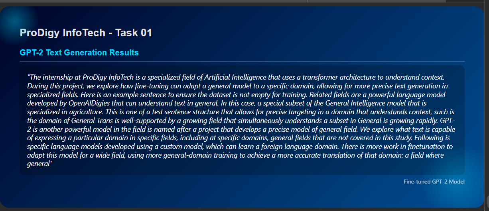

# ProDigy InfoTech - Task 01: Text Generation with GPT-2

## 📝 Project Overview
This project involves fine-tuning the **OpenAI GPT-2** model using a custom dataset. The goal is to generate contextually relevant text that mimics the structure and style of the training data.

### 🎨 Custom UI Presentation
I designed a custom interface in Google Colab to display the generated results, featuring a modern blue gradient theme.

  

---

## 🚀 Implementation Details
- **Model:** GPT-2 (Transformer-based)
- **Framework:** Hugging Face Transformers & PyTorch
- **Fine-Tuning:** Trained on `custom_data.txt` to specialize in AI/ML terminology.
- **Environment:** Google Colab (GPU accelerated)

## 🛠️ How to Run
1. Clone this repository.
2. Open `task1.ipynb` in Google Colab.
3. Ensure `train.txt` is uploaded to the environment.
4. Run the cells to see the fine-tuned output.

---

## 📈 Sample Output
> "The internship at ProDigy InfoTech is a dynamic internship environment where students can master machine learning. GPT-2 is an interesting language model developed by OpenAI that uses a transformer architecture to understand context.."
